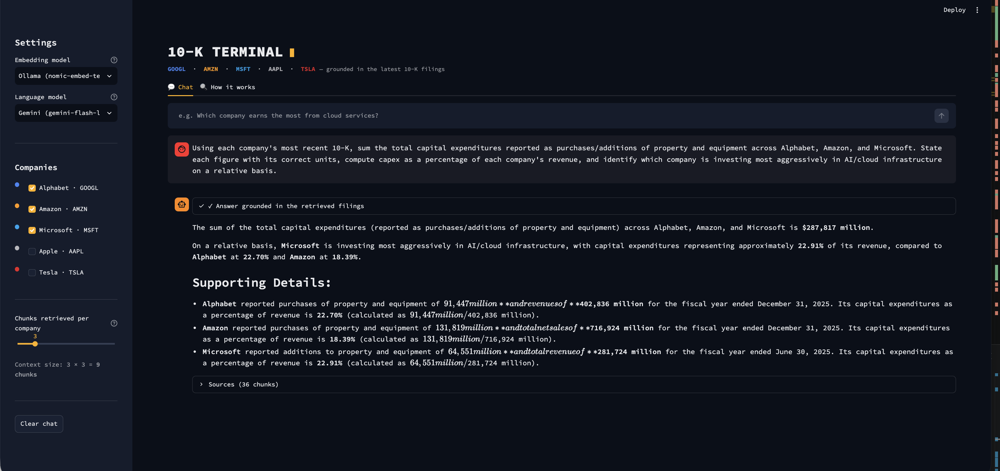

# Hallucination case study 

## Selected Question

**Q10 — Capital Expenditures and AI/Cloud Infrastructure**

> Using each company's most recent 10-K, sum the total capital expenditures reported as purchases/additions of property and equipment across Alphabet, Amazon, and Microsoft. State each figure with its correct units, compute capex as a percentage of each company's revenue, and identify which company is investing most aggressively in AI/cloud infrastructure on a relative basis.

## Chatbot Statement

The chatbot concluded:

> “On a relative basis, Microsoft is investing most aggressively in AI/cloud infrastructure, with capital expenditures representing approximately 22.91% of its revenue.”

## Why This Is a Hallucination / Unsupported Inference

The chatbot correctly calculated each company’s total property-and-equipment spending as a percentage of revenue:

- Microsoft: approximately 22.9%
- Alphabet: approximately 22.7%
- Amazon: approximately 18.4%

However, these figures represent **company-wide capital expenditures**, not AI/cloud-only spending. The 10-K filings do not separately disclose the exact portion devoted only to AI or cloud infrastructure.

Therefore, the source supports this conclusion:

> Microsoft had the highest company-wide capex-to-revenue ratio.

But it does not fully support this stronger claim:

> Microsoft was investing most aggressively in AI/cloud infrastructure.

The chatbot presented an inference as though it were directly established by the filings. This is an **unsupported inference**, which can be treated as a hallucination because the interpretation goes beyond the evidence.

## Corrected Answer

> Microsoft had the highest company-wide property-and-equipment spending relative to revenue at approximately 22.9%, narrowly ahead of Alphabet at 22.7% and Amazon at 18.4%. However, these figures include capital expenditures for purposes beyond AI and cloud infrastructure, so they should be interpreted as company-wide capex intensity rather than a precise comparison of AI/cloud-only investment.

## Failure Classification

- **Failure type:** Unsupported inference
- **Hallucination:** Yes
- **Score for Q10:** 2/3

## Why This Case Matters

This case shows that a RAG chatbot may retrieve and calculate all numbers correctly but still produce an overconfident conclusion. Reliable retrieval does not automatically guarantee reliable interpretation.

## How to Reduce This Failure

1. Require the chatbot to distinguish between directly reported facts, calculated values, and inferred conclusions.
2. Add a prompt rule requiring caveats when the requested metric is not separately disclosed.
3. Ask the chatbot to state whether each conclusion is directly supported by the filing.
4. Retrieve nearby explanatory notes instead of relying only on cash-flow statement values.

**Screenshot:** 

